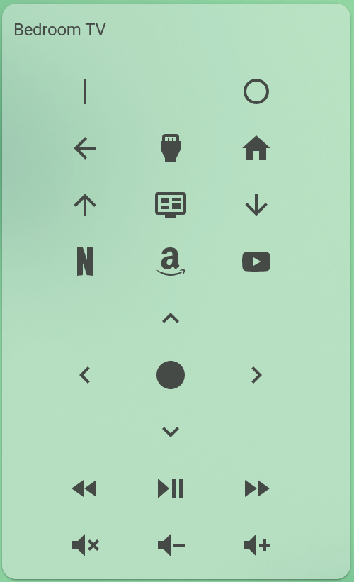

# Denon AVR Remote Card

[![GitHub Release][releases-shield]][releases]
[![License][license-shield]](LICENSE.md)

![Project Maintenance][maintenance-shield]
[![GitHub Activity][commits-shield]][commits]
[](https://github.com/custom-components/hacs)
[![Community Forum][forum-shield]][forum]

[![Github][github]][github]


## Demo:


## Options

| Name | Type | Requirement | Description
| ---- | ---- | ------- | -----------
| type | string | **Required** | `custom:denon-card`
| entity | string | **Required** | `random` entity
| remote | string | **Optional** | `remote` entity of IR device. Default assume named like `entity`
| name | string | **Optional** | Card name
| theme | string | **Optional** | Card theme
| avr | boolean | **Optional** | If `true` shows volume and power buttons. Default `false`
| power | `service` | **Optional, Exclusive**| service to call when power button pressed. When `power` defined, `power_on` and `power_off` are disabled, even when defined
| power_on | `service` | **Optional, Exclusive**| service to call when power_on button pressed. Only enabled if no `power` defined.
| power_off | `service` | **Optional, Exclusive**| service to call when power_off button pressed. Only enabled if no `power` defined.
| back | `service` | **Optional**| service to call when back button pressed
| info | `service` | **Optional**| service to call when info button pressed
| home | `service` | **Optional**| service to call when home button pressed
| up | `service` | **Optional**| service to call when up button pressed
| left | `service` | **Optional**| service to call when left button pressed
| select | `service` | **Optional**| service to call when select button pressed
| right | `service` | **Optional**| service to call when right button pressed
| down | `service` | **Optional**| service to call when down button pressed
| reverse | `service` | **Optional**| service to call when reverse button pressed
| play | `service` | **Optional**| service to call when play button pressed
| forward | `service` | **Optional**| service to call when forward button pressed
| source | `service` | **Optional**| service to call when source button pressed
| channelup | `service` | **Optional**| service to call when channelup button pressed
| channeldown | `service` | **Optional**| service to call when channeldown button pressed
| volume_up | `service` | **Optional**| service to call when volume up button pressed
| volume_down | `service` | **Optional**| service to call when volume down button pressed
| volume_mute | `service` | **Optional**| service to call when volume mute button pressed
| netflix | `service` | **Optional**| service to call when netflix button pressed
| prime_video | `service` | **Optional**| service to call when prime video button pressed
| youtube | `service` | **Optional**| service to call when youtube button pressed

## `service` Options
| Name | Type | Requirement | Description
| ---- | ---- | ------- | -----------
| service | string | **Required** | Service to call
| service_data | string | **Optional** | Service data to use


## Installation

### Step 1:
Install using HACS or [see this guide](https://github.com/thomasloven/hass-config/wiki/Lovelace-Plugins).

### Step 2:

Add a custom element in your `ui-lovelace.yaml`

```yaml
      - type: custom:denon-card
        entity: sun.sun
        name: Living Room Receiver
        tv: true
        power:
          service: switch.turn_on
          service_data:
            entity_id: switch.living_room_avr_power
```

### Example 1:

You can use the card in combination with the [browser mod integration](https://github.com/thomasloven/hass-browser_mod).
That means that you can create an input_boolean which opens a popup when you click its icon:

```yaml
type: entities
entities:
  - entity: input_boolean.avr
    name: AVR
    tap_action:
      action: fire-dom-event
      browser_mod:
        command: popup
        style:
          border-radius: 20px
          '--ha-card-border-radius': 0px
        title: 
        card:
          type: 'custom:denon-card'
          entity: sun.sun
```


[commits-shield]: https://img.shields.io/github/commit-activity/y/marrobHD/tv-card.svg?style=for-the-badge
[commits]: https://github.com/jdmar3/denon-card/commits/master
[forum]: https://community.home-assistant.io/
[license-shield]: https://img.shields.io/github/license/jdmar3/denon-card.svg?style=for-the-badge
[maintenance-shield]: https://img.shields.io/badge/maintainer-jdmar3-blue.svg?style=for-the-badge
[releases-shield]: https://img.shields.io/github/release/marrobHD/tv-card.svg?style=for-the-badge
[releases]: https://github.com/jdmar3/tv-card/releases
[github]: https://img.shields.io/github/followers/jdmar3.svg?style=social
